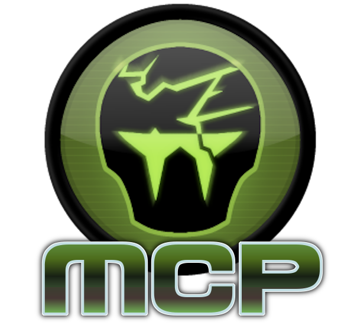

<p align="center">
  
</p>

# zandronum-mcp

Let an AI assistant supercharge Zandronum development from your editor: Write C++ code, ACS, DECORATE, fix bugs, the works.


## Setup

1. **Download the engine.** Grab the build for your OS from
   [Releases](https://github.com/rc4l/ZandronumMCP/releases) and unzip it anywhere.
   - **Windows:** `zandronum-mcp-engine-windows-x64.zip` → point `ZANDRONUM_EXE` at `zandronum-mcp-hooks.exe`.
   - **macOS:** `zandronum-mcp-engine-macos-x64.zip` unzips to **`zandronum-mcp-hooks.app`** (Intel
     build, runs under Rosetta 2) → point `ZANDRONUM_EXE` at the `.app` (the MCP finds the binary
     inside it).
   - **Linux or a custom build:**
     [build it yourself](https://github.com/rc4l/ZandronumMCP/blob/main/docs/ADVANCED.md).

2. Learn how to add MCP Servers to your preferred editor. In VS Code, put this in `.vscode/mcp.json` (Cursor, Claude
   Desktop, Windsurf, etc. uses something similar. Go look it up yourself or have your AI agent do it for you)

   ```json
   {
     "servers": {
       "zandronum": {
         "command": "npx",
         "args": ["-y", "zandronum-mcp"],
         "env": {
           "ZANDRONUM_BRIDGE_PORT": "7777",
           "ZANDRONUM_EXE": "C:/path/to/zandronum.exe"
         }
       }
     }
   }
   ```

   Point `ZANDRONUM_EXE` at the `zandronum.exe` you just unzipped, then restart your chat session.

4. Verify with your preferred AI Agent by asking it, "Is Zandronum MCP loaded?" if it responds positively, then it is wired up.

5. You're done. You can now ask your agent to start working on the engine or start making mods. Remember, the MCP only works with the custom build of Zandronum you downloaded or built from step 1.

## Advanced

Building the engine yourself, Linux/macOS, launching manually, running the server
from source, contributing →
**[docs/ADVANCED.md](https://github.com/rc4l/ZandronumMCP/blob/main/docs/ADVANCED.md)**.
